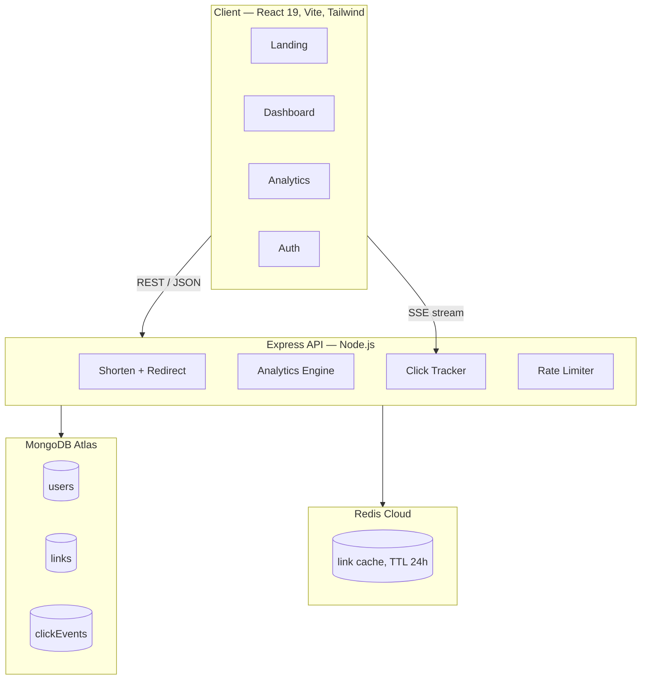

# LinkLens

**URL shortener with real-time analytics — because every link tells a story.**

Live demo → **[link-lens-olive.vercel.app](https://link-lens-olive.vercel.app)**

---

## What it does

LinkLens turns long URLs into short, shareable links and tracks every click in real time. Create a link, share it, then watch the clicks roll in on a live analytics dashboard — broken down by country, device, browser, and referrer source.

Key capabilities:

- **Instant shortening** — anonymous or signed-in, get a short link in under a second
- **Real-time dashboard** — click events stream to the browser via SSE the moment they land
- **Rich analytics** — geo-IP lookup, user-agent parsing, referrer extraction, and historical charts
- **QR code generation** — every link gets a downloadable QR code
- **Link management** — toggle active/inactive, set expiry dates, copy with one click
- **Redis-backed redirects** — short links are cached for 24 h, keeping redirects sub-millisecond at scale

---

## Architecture



---

## Tech stack

| Layer | Technology |
|---|---|
| Frontend | React 19, React Router 7, Vite 8, Tailwind CSS v4 |
| Charts | Chart.js 4 + react-chartjs-2 |
| QR codes | qrcode.react (SVG display + Canvas PNG export) |
| Backend | Node.js 20, Express 5 |
| Database | MongoDB Atlas via Mongoose 9 |
| Cache | Redis via ioredis 5 |
| Auth | JWT (jsonwebtoken), bcryptjs |
| Analytics | geoip-lite (geo), ua-parser-js (device/browser), SSE (real-time push) |
| Security | helmet, cors, express-rate-limit |
| ID generation | nanoid — 6-char Base62 (`A-Za-z0-9`) |

---

## Local setup

### Prerequisites

- Node.js ≥ 20
- A MongoDB Atlas cluster (free tier works)
- A Redis instance — [Upstash](https://upstash.com) free tier or a local `redis-server`

### 1 — Clone

```bash
git clone https://github.com/MKD2004/LinkLens.git
cd LinkLens
```

### 2 — Backend

```bash
cd backend
npm install
```

Create `backend/.env`:

```env
PORT=3000
NODE_ENV=development

MONGO_URI=mongodb+srv://<user>:<pass>@cluster.mongodb.net/linklens

REDIS_URL=redis://localhost:6379
# or Upstash: rediss://<user>:<pass>@<host>.upstash.io:6380

JWT_SECRET=replace-with-a-long-random-string
BASE_URL=http://localhost:3000

ALLOWED_ORIGINS=http://localhost:5173
```

```bash
npm run dev        # nodemon — watches for changes
# or
npm start          # plain node
```

The API is now at `http://localhost:3000`.

### 3 — Frontend

```bash
cd frontend
npm install
```

Create `frontend/.env`:

```env
VITE_API_URL=http://localhost:3000
```

```bash
npm run dev        # Vite dev server at http://localhost:5173
```

### 4 — Production build (frontend)

```bash
npm run build      # outputs to frontend/dist/
npm run preview    # serve the built output locally
```

---

## API reference

All authenticated endpoints require `Authorization: Bearer <token>`.

| Method | Path | Auth | Description |
|---|---|---|---|
| `POST` | `/api/auth/register` | No | Register — returns JWT |
| `POST` | `/api/auth/login` | No | Login — returns JWT |
| `POST` | `/api/links` | Optional | Create short link; links to user if authenticated |
| `GET` | `/api/links` | Yes | List your links, paginated (`?page=1&limit=10`, max 50) |
| `GET` | `/r/:shortId` | No | Redirect (301) and record click |
| `PATCH` | `/api/links/:shortId/toggle` | Yes | Toggle link active / inactive |
| `DELETE` | `/api/links/:shortId` | Yes | Delete link and all its click events |
| `GET` | `/api/links/:shortId/analytics` | Yes | Aggregated analytics (clicks, geo, device, referrer) |
| `GET` | `/api/links/:shortId/events` | Yes | SSE stream of live click events |
| `GET` | `/api/health` | No | Health check — MongoDB + Redis status |

### Create a link

```bash
curl -X POST http://localhost:3000/api/links \
  -H "Content-Type: application/json" \
  -H "Authorization: Bearer <token>" \
  -d '{"url": "https://example.com/very/long/path"}'
```

```json
{
  "shortId": "aB3xYz",
  "shortUrl": "http://localhost:3000/r/aB3xYz",
  "originalUrl": "https://example.com/very/long/path",
  "createdAt": "2025-06-30T10:00:00.000Z"
}
```

---

## How the redirect cache works

```
GET /r/:shortId
      │
      ├─ Redis HIT  →  301 redirect  (sub-ms, no DB touch)
      │                recordClick() fires async
      │
      └─ Redis MISS →  MongoDB lookup
                    →  301 redirect
                    →  cache in Redis for 24 h
                    →  recordClick() fires async
```

`recordClick` hashes the raw IP with SHA-256 before storing it, extracts geo, device, and referrer, persists a `ClickEvent` document, and broadcasts the event to any SSE subscribers on that short link.

---

## Project structure

```
LinkLens/
├── backend/
│   └── src/
│       ├── config/         # MongoDB connection
│       ├── middleware/      # auth, rate-limiter, validation, error handler
│       ├── models/          # User, Link, ClickEvent (Mongoose schemas)
│       ├── routes/          # authRoutes, linkRoutes, analyticsRoutes, sseRoutes
│       └── services/        # redis client, geoip, ua-parser, SSE manager, clickTracker
└── frontend/
    └── src/
        ├── components/      # Navbar, LinkCard, QRModal, LoadingSkeleton, ErrorBoundary
        │   └── landing/     # AnimatedSphere (ASCII canvas), landing sections
        ├── contexts/        # AuthContext (JWT + user state)
        └── pages/           # Landing, Login, Dashboard, Analytics
```
